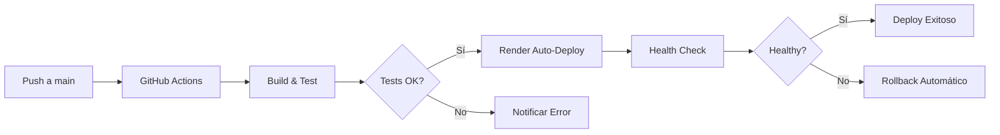

# 🚀 Despliegue de Eventura en Render

Guía completa para desplegar la aplicación Eventura (.NET 9 MVC) en Render.

## 📋 Requisitos Previos

1. Cuenta en [Render](https://render.com) (gratuita)
2. Repositorio en GitHub
3. Dockerfile configurado (✅ ya incluido)

## 🎯 Despliegue Automático con Blueprint

### Paso 1: Preparar el Repositorio

Asegúrate de que el archivo `render.yaml` esté en la raíz del proyecto.

### Paso 2: Conectar con Render

1. Ve a [Render Dashboard](https://dashboard.render.com)
2. Click **"New +"** → **"Blueprint"**
3. Conecta tu repositorio GitHub `eventura-dotnet-mvc`
4. Render detectará automáticamente `render.yaml`
5. Click **"Apply"**

### Paso 3: Configurar

El blueprint creará automáticamente:
- **Web Service**: `eventura-app`
- **Health Check**: `/health`
- **Environment**: Production

## 🔧 Despliegue Manual

### Opción A: Docker

1. **New → Web Service**
2. Conecta tu repositorio
3. Configuración:
   ```
   Name: eventura-app
   Environment: Docker
   Dockerfile Path: ./Dockerfile
   Region: Frankfurt (o más cercano)
   Plan: Free
   ```

4. **Environment Variables**:
   ```
   ASPNETCORE_ENVIRONMENT=Production
   ASPNETCORE_URLS=http://+:8080
   ```

5. **Health Check Path**: `/health`

6. Click **"Create Web Service"**

### Opción B: .NET Native

1. **New → Web Service**
2. Configuración:
   ```
   Name: eventura-app
   Environment: .NET
   Build Command: dotnet publish src/Eventura.Web/Eventura.Web.csproj -c Release -o out
   Start Command: dotnet out/Eventura.Web.dll
   Plan: Free
   ```

## 🌐 URLs de Acceso

Después del despliegue:

- **Aplicación**: `https://eventura-app.onrender.com`
- **Health Check**: `https://eventura-app.onrender.com/health`
- **Login**: `https://eventura-app.onrender.com/Account/Login`

### Credenciales por Defecto

```
Usuario: admin
Email: admin@eventura.local
Contraseña: AdminPass123!
```

⚠️ **IMPORTANTE**: Cambia estas credenciales inmediatamente en producción.

## ⚙️ Variables de Entorno

### Requeridas

```bash
ASPNETCORE_ENVIRONMENT=Production
ASPNETCORE_URLS=http://+:8080
```

### Opcionales

```bash
# Logging
Serilog__MinimumLevel__Default=Information

# Rate Limiting
RateLimit__PermitLimit=100
RateLimit__Window=00:01:00

# Security Headers
Security__XFrameOptions=DENY
Security__ContentSecurityPolicy="default-src 'self'"
```

## 🗄️ Base de Datos (Opcional)

### Para usar PostgreSQL en Render:

1. **New → PostgreSQL**
2. Configuración:
   ```
   Name: eventura-db
   Database: eventura
   User: eventura_user
   Plan: Free (256MB)
   ```

3. Actualizar `render.yaml`:
   ```yaml
   envVars:
     - key: ConnectionStrings__Default
       fromDatabase:
         name: eventura-db
         property: connectionString
   ```

4. Modificar `Program.cs` para usar PostgreSQL en vez de in-memory.

## 🔍 Monitoreo

### Health Checks

```bash
# Check básico
curl https://eventura-app.onrender.com/health

# Respuesta esperada:
{
  "status": "Healthy",
  "timestamp": "2025-01-22T17:30:00Z",
  "version": "1.0.0"
}
```

### Logs

Ver logs en tiempo real:
1. Dashboard → eventura-app → **Logs** tab
2. O usa el CLI: `render logs eventura-app`

Los logs incluyen:
- ✅ Solicitudes HTTP
- ✅ Errores de aplicación
- ✅ Inicialización de servicios
- ✅ Correlation IDs para trazabilidad

## 🚨 Troubleshooting

### Error: "Application failed to start"

```bash
# Revisar logs
render logs eventura-app

# Verificar health endpoint
curl https://eventura-app.onrender.com/health
```

**Causas comunes**:
- Puerto incorrecto (debe ser 8080)
- Variables de entorno mal configuradas
- Dockerfile con errores

### Error: "502 Bad Gateway"

El servicio está iniciando o crasheó:
1. Espera 30-60 segundos (cold start)
2. Revisa logs para errores
3. Verifica que el health check esté configurado

### Error: "Rate limit exceeded"

El rate limiter está activo (100 req/min por defecto):
- Ajusta `RateLimit__PermitLimit` en variables de entorno
- O desactiva rate limiting temporalmente

## 💰 Costos y Límites

### Plan Free

- ✅ 750 horas/mes de runtime
- ✅ 100GB bandwidth saliente
- ✅ SSL automático
- ✅ Deploy automático desde Git
- ⚠️ Duerme después de 15 min inactividad
- ⚠️ 30s para despertar (cold start)

### Plan Starter ($7/mes)

- ✅ Siempre activo (no duerme)
- ✅ Más recursos (512MB RAM)
- ✅ Custom domains
- ✅ Priority support

## 🔄 CI/CD Automático

Con el workflow de GitHub Actions:



## 📊 Métricas de Rendimiento

Render proporciona métricas automáticas:
- CPU usage
- Memory usage
- Request rate
- Response times
- Error rate

Accede en: Dashboard → eventura-app → **Metrics**

## 🔐 Seguridad en Producción

### Recomendaciones

1. **Cambiar credenciales por defecto**
2. **Habilitar HTTPS** (automático en Render)
3. **Configurar CORS** apropiadamente
4. **Implementar secrets management**:
   ```bash
   # NO hardcodear secrets
   # Usar Environment Variables en Render
   ```

5. **Rate limiting activo** (ya configurado)
6. **Security headers** (ya configurados)

## 🌍 Dominios Personalizados

### Agregar Custom Domain

1. Dashboard → eventura-app → **Settings**
2. Click **"Add Custom Domain"**
3. Ingresa tu dominio: `eventura.tudominio.com`
4. Configurar DNS:
   ```
   Type: CNAME
   Name: eventura
   Value: eventura-app.onrender.com
   ```

5. Esperar propagación DNS (5-60 min)
6. SSL automático vía Let's Encrypt

## 📚 Recursos

- [Render .NET Docs](https://render.com/docs/deploy-net)
- [Docker Deployment](https://render.com/docs/docker)
- [Environment Variables](https://render.com/docs/environment-variables)
- [Custom Domains](https://render.com/docs/custom-domains)

## ✅ Checklist de Producción

- [ ] Cambiar credenciales admin
- [ ] Configurar dominio personalizado
- [ ] Habilitar PostgreSQL (si es necesario)
- [ ] Configurar monitoreo/alertas
- [ ] Backup de base de datos
- [ ] Rate limiting ajustado
- [ ] Logging estructurado activo
- [ ] Security headers verificados
- [ ] Health checks funcionando
- [ ] CI/CD pipeline activo
