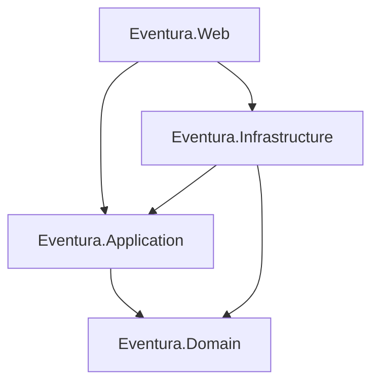

# Eventura

Eventura es una plataforma ASP.NET Core MVC (target .NET 9.0) para gestionar eventos, reservas y paneles operativos sobre una arquitectura Clean (Domain · Application · Infrastructure · Web). El objetivo es servir como base pedagógica y lista para producción ligera, priorizando seguridad, pruebas y una experiencia de usuario moderna.

## Arquitectura Clean



- **Domain**: Entidades ricas, objetos de valor, excepciones tipadas e invariantes.
- **Application**: Casos de uso, DTOs inmutables, validaciones y contratos (puertos).
- **Infrastructure**: Implementaciones in-memory (repositorios, unit of work), hashing PBKDF2, correo simulado, proveedores de tiempo y correlación.
- **Web**: Controladores MVC delgados, vistas Razor, autenticación por cookies, autorización basada en roles, rate limiting, cabeceras endurecidas y middleware para correlación.

## Experiencia de usuario

- Layout responsive mobile-first con navegación accesible, menú colapsable y skip-link (`site.css`, `_Layout.cshtml`).
- Diseño visual limpio con tarjetas, tablas envolventes, métricas y estados vacíos descriptivos.
- Formularios con validación client-side, mensajes estructurados (`alert-success`/`alert-error`) y feedback visual en envíos (`data-loading` + spinner).
- Listados con filtros en vivo (búsqueda, categoría y estado) y estados 0-resultados controlados por `site.js`.
- Vistas actualizadas: Home (hero + métricas), Events (panel de gestión), Recommendations, Details, Create/Edit, reservas y vistas de cuenta.

## Puesta en marcha rápida

### Requisitos

- .NET SDK 9.0 instalado (`dotnet --version` ≥ 9.0.x).
- Certificado de desarrollo confiable (`dotnet dev-certs https --trust`).
- Sin dependencias externas: repositorios en memoria listos para uso local.

### Configuración

1. Clona el repositorio y restaura dependencias:
   ```bash
   dotnet restore
   ```
2. (Opcional) Duplica `appsettings.json` por ambiente (`appsettings.Development.json`, etc.).
3. Mantén secretos fuera del repo (`dotnet user-secrets`, Key Vault, AWS Secrets Manager, etc.).
4. Al iniciar, se siembra un usuario administrador:
   - Usuario: `admin`
   - Correo: `admin@eventura.local`
   - Contraseña: `AdminPass123!`

### Ejecutar la aplicación

```bash
dotnet run --project src/Eventura.Web/Eventura.Web.csproj
```

- URL por defecto: `https://localhost:5001`
- Middleware activos: HTTPS redirection, HSTS, rate limiter, anti-CSRF automático, cabeceras seguras y `X-Correlation-Id`.

## Pruebas y cobertura

| Objetivo | Comando | Notas |
| --- | --- | --- |
| Ejecutar toda la suite | `dotnet test` | Incluye unitarios Domain/Application e integración básica |
| Ejecutar solo dominio | `dotnet test --filter "Eventura.UnitTests.Domain"` | Valida invariantes (capacidad, cancelaciones, etc.) |
| Probar reservas (dominio) | `dotnet test --filter "FullyQualifiedName~Eventura.UnitTests.Domain.EventTests.Reserve"` | Simula éxito y overbooking (409) |
| Generar cobertura | `dotnet test /p:CollectCoverage=true /p:CoverletOutput=artifacts/coverage/ /p:CoverletOutputFormat=\"cobertura\"` | Usa cobertura XPlat incluida en .NET 9 |
| Enforce ≥80 % (Domain/Application) | `dotnet test /p:CollectCoverage=true /p:CoverletOutput=artifacts/coverage/ /p:CoverletOutputFormat=\"json\" /p:Threshold=80 /p:ThresholdType=line /p:Include=\"[Eventura.Domain]*,[Eventura.Application]*\"` | Falla si la cobertura lineal cae por debajo del 80 % |

> **Tip**: añade `reportgenerator "-reports:artifacts/coverage/coverage.cobertura.xml" "-targetdir:artifacts/report"` para transformar la cobertura en HTML.

### Verificación rápida sugerida

1. Ejecuta `dotnet test --filter "Reserve_WithAvailableCapacity_Succeeds"` ⇒ asegura respuesta tipo 201 (flujo feliz) en el dominio.
2. Ejecuta `dotnet test --filter "Reserve_WhenExceedingRemainingCapacity_Throws"` ⇒ modela el 409 esperado al agotar aforo.
3. Abre `https://localhost:5001`, crea un evento (rol Organizer/Admin) y realiza una reserva para validar UI + pipeline completo.

> Próxima iteración: extender pruebas de integración HTTP (registro/login/reservas) para comprobar códigos 200/201/409 end-to-end.

## Solución de problemas

- **Puerto ocupado**: modifica `applicationUrl` en `Properties/launchSettings.json` o ejecuta `dotnet run --urls https://localhost:5003`.
- **Certificado no confiable**: `dotnet dev-certs https --trust`.
- **Tokens anti-CSRF**: confirma que los formularios Razor incluyan `@Html.AntiForgeryToken()` y que las cookies no estén bloqueadas.
- **Cadena de conexión**: el almacenamiento por defecto es in-memory. Define `ConnectionStrings__Default` al conectar una base real.
- **Rate limiting (429)**: el limitador fijo es 100 req/min por host. Ajusta `FixedWindowRateLimiterOptions` en `Program.cs` para escenarios intensivos.
- **Cabecera de correlación**: todas las respuestas exponen `X-Correlation-Id`. Incluye el mismo valor en llamadas subsecuentes para trazar logs.

## Scripts útiles (`/scripts`)

- `restore.(ps1|sh)`, `build.(ps1|sh)`, `test.(ps1|sh)`, `run.(ps1|sh)`, `publish.(ps1|sh)` encapsulan los comandos dotnet básicos.

## CI/CD

Workflow GitHub Actions (`.github/workflows/ci.yml`):

1. Restaurar > compilar.
2. Ejecutar pruebas con cobertura (`dotnet test --collect:"XPlat Code Coverage"`).
3. Publicar artefactos (`dotnet publish`).

Integra fácilmente pasos adicionales (lint, análisis estático, despliegues) aprovechando la separación por capas.

## Próximos pasos sugeridos

- Añadir pruebas de integración completas (auth, CRUD, reservas concurrentes) que verifiquen códigos 200/201/400/401/403/409.
- Incorporar caching, cabeceras de seguridad adicionales y compresión para producción.
- Contenerizar la solución (Docker) y preparar health checks (`/health`) con métricas básicas.

---

Licencia: MIT.
