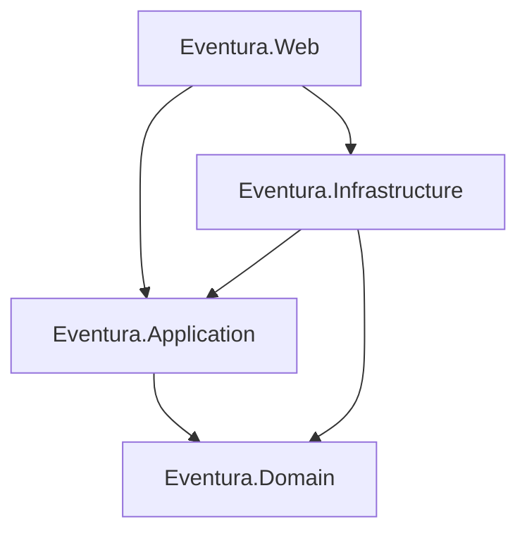

# Eventura

Eventura es una plataforma MVC construida con .NET 8 que permite gestionar eventos locales de forma segura. El proyecto sigue una arquitectura por capas (Domain, Application, Infrastructure y Web) y ofrece módulos funcionales de ejemplo para autenticación, gestión de eventos, reservas, recomendaciones y un panel administrativo.

## Arquitectura

- **Domain**: Entidades, reglas de negocio y contratos de repositorio.
- **Application**: Casos de uso, DTOs, validaciones y servicios.
- **Infrastructure**: Implementaciones concretas (almacenamiento en memoria, hashing PBKDF2, proveedores de tiempo, correo, correlación).
- **Web**: Controladores MVC, vistas Razor, configuración de seguridad (HTTPS, cookies seguras, rate limiting, CSRF).

## Características principales

- Registro e inicio de sesión con roles (Usuario, Organizador, Admin), hashing PBKDF2 y bloqueo tras intentos fallidos.
- CRUD de eventos con validaciones de dominio y aplicación.
- Reservas con control de aforo y confirmaciones visuales.
- Recomendaciones filtradas por ciudad y categoría.
- Panel administrativo con métricas básicas de asistencia y cancelaciones.
- Seguridad reforzada: HTTPS obligatorio, cookies seguras, CSRF, sanitización por Razor, rate limiting global y correlación de peticiones.
- Manejo global de errores, logs estructurados y proveedor de id de correlación.
- Tests unitarios (Domain/Application) e integrados (Web) con xUnit.
- Scripts de utilidad para compilar, probar y ejecutar.

## Como ejecutar Eventura (rapido)

### Requisitos previos

- .NET SDK 8.0 instalado y disponible en la linea de comandos.
- Almacenamiento: el proyecto usa repositorios in-memory por defecto; puedes apuntar a una base local si extiendes Infrastructure.
- Variables de entorno preparadas (no almacenes secretos en el repositorio).

### Configuracion

- Duplica `appsettings.json` por entorno cuando lo necesites (`appsettings.Development.json` como base).
- Establece minimo `ConnectionStrings__Default`, `Email__From` y `Email__ApiKey` (valores dummy para entorno local).
- Gestiona secretos con `dotnet user-secrets` o servicios externos (Azure Key Vault, AWS Secrets Manager, etc.).

### Comandos basicos

- `dotnet restore` para descargar dependencias.
- `dotnet build --configuration Debug` para compilar en modo desarrollo.
- `dotnet test` para ejecutar pruebas unitarias e integradas.
- `dotnet run --project src/Eventura.Web/Eventura.Web.csproj` para lanzar la aplicacion (perfil Development).
- URL local prevista: `https://localhost:5001` (ajusta en `launchSettings.json` si es necesario).

### Inicializacion de datos (opcional)

- Ejecuta migraciones locales cuando agregues una base real (no aplica al almacenamiento in-memory actual).
- El arranque siembra un usuario Admin:
  - Usuario: `admin`
  - Correo: `admin@eventura.local`
  - Contrasena: `AdminPass123!`
- Nota: actualiza estas credenciales tras la primera ejecucion.

### Verificacion rapida

- Abre el navegador en `https://localhost:5001` y revisa la pagina inicial.
- Comprueba el endpoint `/health` (agregalo si trabajas con health checks) o asegurate de que Home responde `200`.
- Realiza el flujo completo: registro -> login -> crear evento (rol Organizer/Admin) -> reservar una plaza.

### Problemas frecuentes (Troubleshooting)

- Puerto ocupado: ajusta `applicationUrl` en `Properties/launchSettings.json` o usa `dotnet run --urls https://localhost:5003`.
- Cadena de conexion invalida: verifica `appsettings.*.json` o las variables de entorno configuradas.
- Certificado de desarrollo: ejecuta `dotnet dev-certs https --trust` para confiar en el certificado local.
- Fallos de migracion: limpia la base (`dotnet ef database drop`) y re-aplica migraciones.
- Anti-CSRF: si un POST falla, valida que el formulario Razor incluya `@Html.AntiForgeryToken()` y que las cookies no esten bloqueadas.

### Scripts de ayuda (`/scripts`)

- `restore.(sh|ps1)`: ejecuta `dotnet restore`.
- `build.(sh|ps1)`: compila la solucion con `dotnet build`.
- `test.(sh|ps1)`: corre pruebas unitarias e integradas con `dotnet test`.
- `run.(sh|ps1)`: inicia Eventura.Web en modo desarrollo.
- `publish.(sh|ps1)`: genera artefactos de despliegue (`dotnet publish`).

## CI/CD

Se proporciona un pipeline de GitHub Actions (`.github/workflows/ci.yml`) que ejecuta:

1. Analisis estatico (`dotnet format`, `dotnet analyzers`).
2. Compilacion y pruebas con cobertura (`dotnet test --collect:"XPlat Code Coverage"`).
3. Publicacion de artefactos (`dotnet publish`).

## Estado del proyecto

El proyecto es funcional y sirve como base para ampliar modulos avanzados (notificaciones, pasarelas de pago, exportacion de metricas, etc.). Las capas y servicios estan desacoplados, lo que facilita reemplazar la infraestructura en memoria por una base de datos relacional o servicios externos.

## Licencia

MIT

## Checklist de esta iteracion

- [x] Comentarios XML /// en clases clave de Web, Application, Domain e Infrastructure.
- [x] Comentarios internos por metodo con Contexto / Intencion / Pasos / Validaciones / Manejo de errores.
- [x] Regiones `#region Aprendizaje` agregadas en controladores, casos de uso, entidades, repositorios y middleware.
- [x] TODO(aprendizaje) distribuidos como ejercicios guiados.
- [x] README ampliado con ejecucion rapida, verificacion y troubleshooting.
- [x] Tests con narrativa Given/When/Then y concepto validado.
- [x] Arquitectura, nombres publicos y rutas conservados sin modificaciones.
