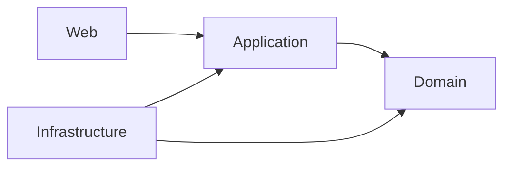

# Arquitectura de Eventura

Eventura implementa una arquitectura limpia con cuatro capas principales:

1. **Domain**: modelos, lógica de negocio y contratos.
2. **Application**: servicios de casos de uso, DTOs, validaciones y orquestación.
3. **Infrastructure**: adaptadores técnicos (persistencia en memoria, hashing, correo, logging) y composición de dependencias.
4. **Web**: capa de presentación MVC con controladores, vistas Razor, middlewares y configuración.

Las dependencias fluyen hacia el dominio, garantizando aislamiento y facilidad de pruebas. La infraestructura puede sustituirse por implementaciones basadas en bases de datos relacionales u otros proveedores sin alterar la capa de aplicación.
